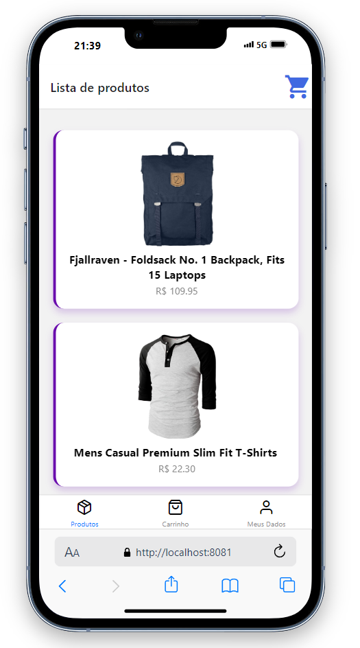
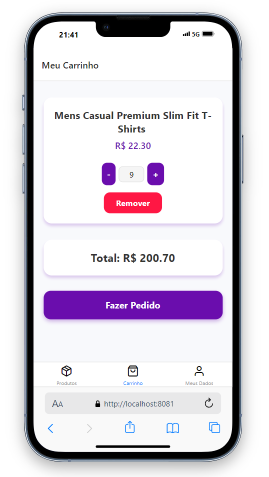
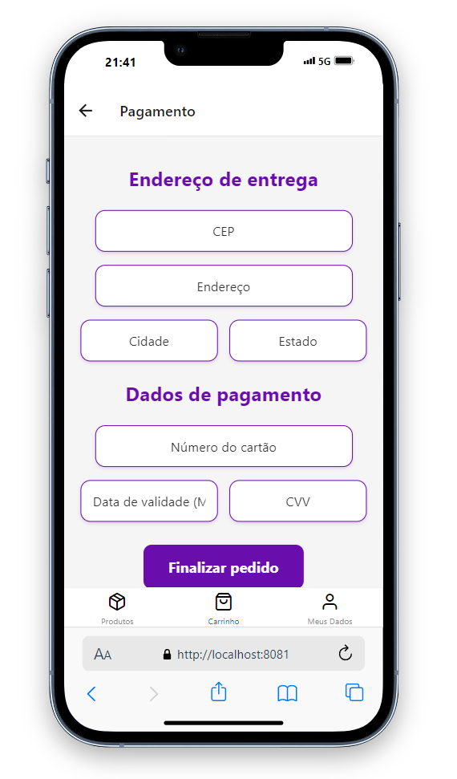

# 💻 Shopping Cart (Expo App)


> - This project is a web and mobile application focused on shopping cart functionality, including a payment interface and delivery tracking. It allows users to select products, add them to the cart, enter payment details, and finalize the purchase. Application developed in class to evaluate the subject "UC15 - React Native" of the Bilingual Systems Development Technician course, at SENAC - São Leopoldo.

### 📋 | Key Features

- **Add and Remove Items:** Users can add products to the cart, modify quantities, and remove items with confirmation alerts.
Price Calculation: The total price is automatically calculated based on the selected items and quantities in the cart.

- **Payment Details:** Users can input card details (card number, expiration date, CVV), which are formatted automatically for easy entry.

- **Local Storage for Cart:** The shopping cart data is stored using local storage (for web) or AsyncStorage (for mobile), ensuring persistence across sessions.

- **Order Confirmation:** After payment confirmation, users see a success message, the cart is cleared, and they are redirected to the home screen.

- **Order History:** Users can view their order history and check the delivery status of past orders.

- **Responsive Design:** The app is optimized for both web and mobile platforms, ensuring usability across devices.

### 📝 | How to Use

1. **Choosing a Product**
Upon opening the app, you will be presented with a list of available products. Click on a product to view its details, including description, price, and any available options.

2. **Adding to Cart**
On the product detail page, select the quantity you wish to purchase and click the “Add to Cart” button. After adding, you’ll be redirected to the cart screen.

3. **Viewing the Cart**
You can access the cart anytime by clicking the cart icon located in the upper right corner. The cart displays added products, their quantities, and the total amount.

4. **Checkout Process**
Click the “Proceed to Checkout” button on the cart screen to begin the payment process. You will be redirected to the payment page.

5. **Entering Payment Details**
On the payment screen, fill in your payment details (credit card number, expiration date, CVV) and shipping address. Double-check your order summary and click “Confirm Payment” to finalize the transaction.

6. **Completing the Purchase**
Once payment is confirmed, you’ll receive a success message, along with a summary of your order. You can track the order status in the "Order History" section.

### 📂 | Project Structure

- Components/ `Reusable UI components (e.g., product card, cart item)` 
- Contexts/ `Global state management (e.g., for cart data)` 
- Screens/  `Different app screens (e.g., Home, Cart, Payment)` 
- Utils/  `Helper functions (e.g., price calculation, payment validation)` 
- Assets/  `Images, icons, and static resources` 
- App.js  `Main application entry point` 

### 🛠️ | Technologies Used

- [X] HTML/CSS: For styling and ensuring responsiveness according to best practices.
- [X] JavaScript/React: For building the app's functionality and managing state.
- [X] CMS Tools: For managing content and product listings.
- [X] Local/Remote Servers: Websites are hosted locally or remotely as per project requirements.
- [X] User Manual: A manual is provided for users to understand how to navigate the app.

### 🚀 | Installing the project

To install the `Shopping Cart` application, follow these steps:

In GitBash:

```
git clone https://github.com/vitorlnm/ReactNative-ShoppingCart.git
```

```
cd /ReactNative-ShoppingCart.git
```

```
npm install
```

```
npx expo --tunnel
```

### 🖼️ | Examples

<table>
  <tr>
    <td style="text-align: center;">
      <p>Product List</p>
      
    </td>
    <td style="text-align: center;">
      <p>Shopping Cart</p>
      
    </td>
    <td style="text-align: center;">
      <p>Payment Session</p>
      
    </td>
  <td style="text-align: center;">
      <p>Order Completion</p>
      
    </td>
  </tr>
</table>

## 🤝 Collaborators

<table>
  <tr>
    <td align="center">
      <a href="#" title="Rafael Kasper">
        <br>
        <sub>
          <b>Rafael Kasper - Teacher</b>
        </sub>
      </a>
    </td>

  <td align="center">
      <a href="#" title="Vitor Gabriel">
        <br>
        <sub>
          <b>Vitor Gabriel - Developer 1</b>
        </sub>
      </a>
    </td>

<td align="center">
      <a href="#" title="Renan Bernardo">
        <br>
        <sub>
          <b>Renan Bernardo - Developer 2</b>
        </sub>
      </a>
    </td>
  </tr>

</table>
